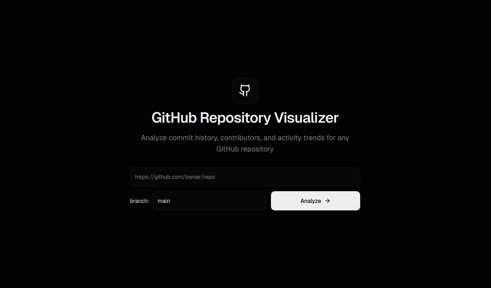
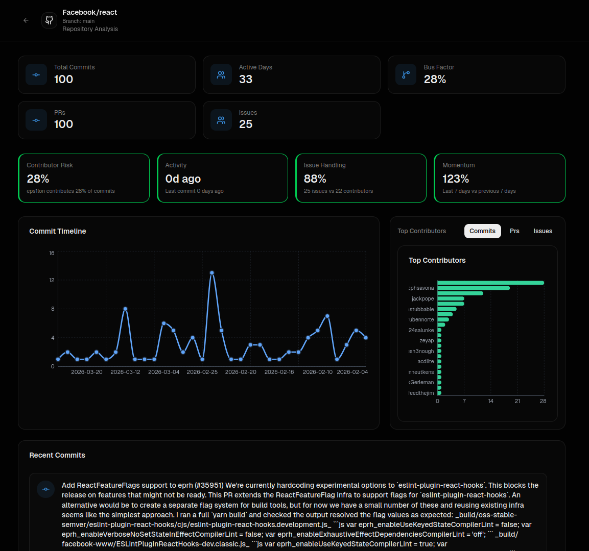

# GitHub Repository Visualizer

> Analyze commit history, contributors, and activity trends for any GitHub repository — instantly.

## 📸 Preview





## 🚀 Live Demo

https://git-hub-repository-visualizer.vercel.app

## ✨ Features

* 📊 Commit timeline visualization
* 👥 Contributor insights & rankings
* 🔀 PR and Issue tracking
* 📈 Activity & momentum analysis
* ⚠️ Contributor risk detection

## 🧠 Why this exists

GitHub gives raw data — but not clarity.

This tool transforms repository data into **clear, visual insights** so you can:

* Understand project health
* Identify key contributors
* Track development trends

## ⚙️ Tech Stack

* Next.js
* TypeScript
* GitHub REST API
* (add anything else you used)

## 🛠️ Installation

```bash
git clone https://github.com/Anshul2308z/GitHub-Repository-Visualizer
cd GitHub-Repository-Visualizer
pnpm install
pnpm run dev
```

## 🔑 Environment Variables

Create a `.env.local` file:

```env
GITHUB_TOKEN=your_github_token
```

## 📊 Usage

1. Enter any GitHub repository URL
2. Click **Analyze**
3. Get instant visual insights

## 🚧 Roadmap


* [ ] Compare multiple repositories
* [ ] Export analytics reports
* [ ] Advanced contributor graphs
* [ ] Smarter caching & performance

## 🤝 Contributing

See [CONTRIBUTING.md](./CONTRIBUTING.md)

## 📄 License

MIT — see [LICENSE](./LICENSE)
